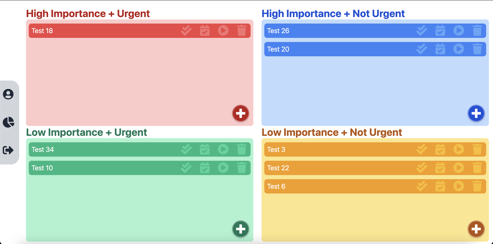
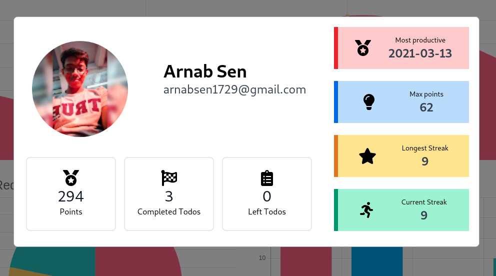
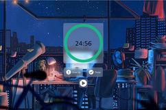
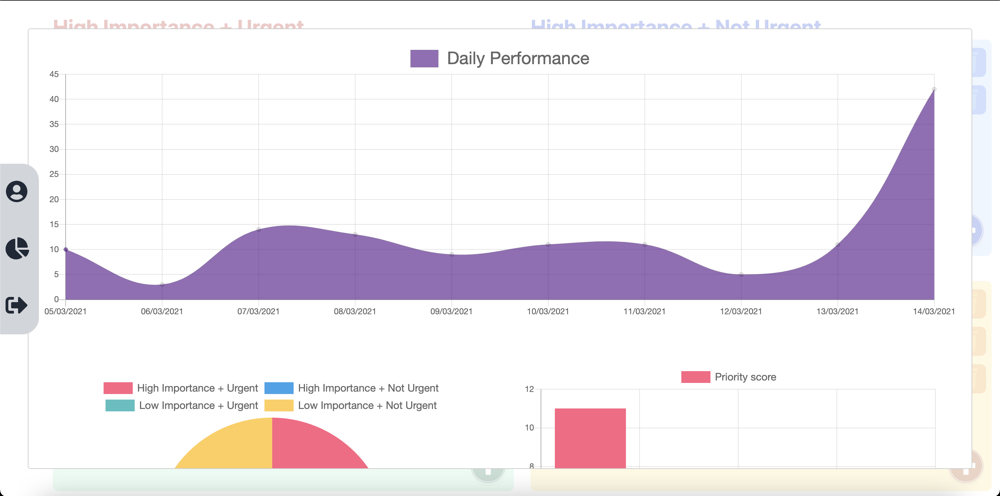
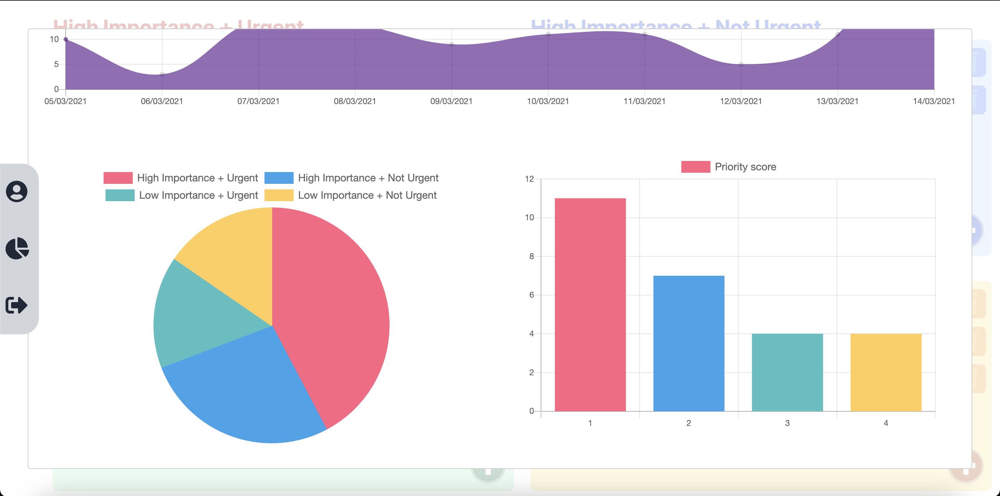

# Kronos tracker

Maintaining todos is hard. So, we created a web app that will keep our tasks organized, group tasks on the basis of their priority and urgency. Display progress reports and other statistics, that will keep us boosted and improve our productivity. Also, has a timer with a white noise that will help us concentrate on the task we are currently doing.

## Screenshots
## Todo Overview

### User profile

### Timer

### Charts

## Demo

## Inspiration

We have a lot of tasks on our hands which are difficult to be remembered. Often we miss out on a task or two. At the end of the day,  we realize that the most important ones get missed out because it was lost among the other unimportant todos. This is due to a lack of organization in the traditional todo system.

Steven R Covey, an American educator, author, businessman, and keynote speaker. mentioned in his book "The 7 Habits of Highly Effective People." an approach to time management which is to create time to focus on important things before they become urgent. This is called Covey's 4 quadrant rule.

We took inspiration from that idea and implemented a to-do management web app, that will keep a note of your jobs according to your priority and level of urgency. It will remind you at the required time and also it has a timer that will accompany you during your work. You can even visualize your progress through various graphs. We also have a point-based scoring system that will reward you every time you complete a task, thus keeping you motivated to achieve more.

## Features

1. Login using a Google account or as a Guest user.
2. Add your todos according to your priority and urgency and reorder them using drag and drop.
3. Feature to add a task to the Google calendar with the set time and duration to get a reminder.
4. An integrated timer with soft music that will accompany you during doing your work and help you focus.
5. Personal User profile modal, where you can get to know your total score, todos left to be done, and todos that you have completed. You can even see your longest streak, most productive days, and other attributes, that can boost you to increase your productivity day by day.
6. Monitor your progress using pie charts and bar graphs. Also, each day's score is plotted on a line chart over the last 10 days.

## How we built it
We used the following technologies in the

Frontend:
1. React framework
2. Tailwind CSS

Backend:
1. Firebase Cloud firestore

## Challenges we ran into

1. Maintaining the firebase collections for a large number of tasks and points.
2. Using drag and drop of react component.
3. Integration of firebase google authentication with React was something new for us.
4. Customizing our own music player was something we were stuck into for a long time.
5. Creating the countdown timer from scratch.
6. Since this was completely online, coordinating and discussing ideas and views among teammates was another challenge.

## Accomplishments that we're proud of

1. We were able to implement an app, that people can use in their day-to-day lives and aid them to improve their productivity.
2. The fact that we were able to make the product within 48 hours, is something we are really proud of.
3. This is the first time we made a full-stack web app using Firebase and React and deployed it with vercel.

## What we learned

1. We learned to use the collections of firebase and maintain sub collections for a large no of users.
2. We learned to use chart.js, material UI and drag and drop components of react.
3. Creating our own countdown timer was new for us.
4. Using Google OAuth was also something new.

## What's next for Kronos Tracker

We hope to expand the idea of kronos tracker in the following ways:-

1.  User can login using other social handles or github.
2.  We can maintain a leader board of various users.
3.  Extend the user dashboard from where the user can share their success to social media.

## Team: kronos-tracker

<table>
  <tr>
    <td align="center">
    <a href="https://arnabsen.rocks/">
    
     
    
    <b>Arnab Sen</b></a> <a href="https://github.com/arnabsen1729/WeCare/commits?author=arnabsen1729" title="Documentation">📖</a><td align="center"><a href="https://github.com/Rajdeep-G"> <b>Rajdeep Ghosh</b></a> <a href="https://github.com/arnabsen1729/WeCare/commits?author=Rajdeep-G" title="Documentation">📖</a></td></td>
    <td align="center"><a href="https://github.com/berakrishnendu36"> <b>Krishnendu Bera</b></a> <a href="https://github.com/arnabsen1729/WeCare/commits?author=berakrishnendu36" title="Documentation">📖</a></td>
    
  </tr>
</table>